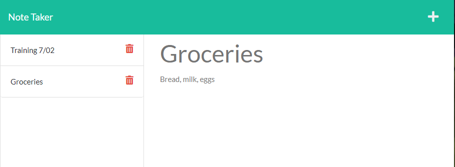

 
# Express Note Taker
## Licensing:

## Description
This application allows the user to enter, save, and delete notes. It uses an Express.js back end and saves and retrieve note data from a JSON file. It was created to meet the following acceptance criteria: 
* GIVEN a note-taking application 
* WHEN I open the Note Taker 
* THEN I am presented with a landing page with a link to a notes page 
* WHEN I click on the link to the notes page 
* THEN I am presented with a page with existing notes listed in the left-hand column, plus empty fields to enter a new note title and the note’s text in the right-hand column
* WHEN I enter a new note title and the note’s text 
* THEN a Save icon appears in the navigation at the top of the page 
* WHEN I click on the Save icon 
* THEN the new note I have entered is saved and appears in the left-hand column with the other existing notes 
* WHEN I click on an existing note in the list in the left-hand column 
* THEN that note appears in the right-hand column WHEN I click on the Trash icon next to a saved note THEN the note is deleted from the list in the left-hand column
## Table of Contents
* [Installation](#Installation)
* [Usage](#Usage)
* [Contributors](#Contributors)
* [Testing](#Testing)
* [Questions](#Questions)
## Installation
Download all files to your local environment, install Node.js if not already installed, and then the dependencies (express, fs, path, nid).
## Usage
The app can be run from the command line or you can use a platform such as Heroku to deploy the application.
Application Homepage

Notes Page

Enter Notes

Delete Notes

## Technologies
* HTML
* CSS
* Bootstrap
* JavaScript
* Node.js
* Express.js
* fs
* nid
* Heroku
## Contributors
Please contact me via the email below or create a pull request on a new branch if you would like to contribute to the project.
## Future Considerations
The functionality of the app could be improved by allowing the user to retrieve deleted notes.
## Questions 
#### To contribute, please contact me by email.

https://github.com/shelleymcq or email me at shelleymcq.dev@gmail.com
